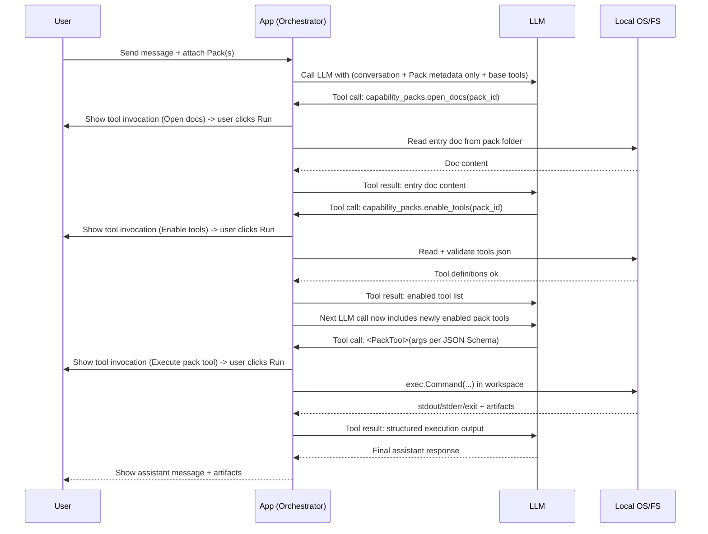

# Capability Packs — Requirements Specification (Local, Skill-Inspired)

- [1. Overview](#1-overview)
- [2. Core principles](#2-core-principles)
- [3. Definitions](#3-definitions)
- [4. Pack folder format](#4-pack-folder-format)
  - [4.1 Folder structure (recommended)](#41-folder-structure-recommended)
  - [4.2 Entry doc resolution (defaults)](#42-entry-doc-resolution-defaults)
  - [4.3 Required metadata](#43-required-metadata)
- [5. Chat integration model](#5-chat-integration-model)
  - [5.1 Attachment semantics](#51-attachment-semantics)
  - [5.2 What is injected by default (metadata only)](#52-what-is-injected-by-default-metadata-only)
  - [5.3 Bootstrap instruction (required)](#53-bootstrap-instruction-required)
- [6. Tooling protocol (host-provided base tools)](#6-tooling-protocol-host-provided-base-tools)
  - [6.1 `capability_packs.open_docs`](#61-capability_packsopen_docs)
  - [6.2 `capability_packs.read_file`](#62-capability_packsread_file)
  - [6.3 `capability_packs.enable_tools`](#63-capability_packsenable_tools)
  - [6.4 `capability_packs.exec_best_effort`](#64-capability_packsexec_best_effort)
- [7. Pack tools (`tools.json`) and tool exposure](#7-pack-tools-toolsjson-and-tool-exposure)
  - [7.1 `tools.json` role](#71-toolsjson-role)
  - [7.2 Tool exposure behavior](#72-tool-exposure-behavior)
  - [7.3 Execution requirements](#73-execution-requirements)
- [8. Local execution requirements](#8-local-execution-requirements)
  - [8.1 Execution method](#81-execution-method)
  - [8.2 Workspace](#82-workspace)
  - [8.3 Artifacts](#83-artifacts)
- [9. Security, gating, and limits (non-functional requirements)](#9-security-gating-and-limits-non-functional-requirements)
  - [9.1 Universal gating](#91-universal-gating)
  - [9.2 Filesystem safety](#92-filesystem-safety)
  - [9.3 Process safety](#93-process-safety)
  - [9.4 Auditability](#94-auditability)
- [10. Error handling requirements](#10-error-handling-requirements)
- [Progressive disclosure explained](#progressive-disclosure-explained)
  - [Stages](#stages)
  - [Mermaid sequence diagram (end-to-end)](#mermaid-sequence-diagram-end-to-end)

## 1. Overview

**Capability Packs** are local, folder-based bundles that enhance an LLM’s effective capability during chat by providing:

- **Discoverability metadata** (low-token, always present when attached)
- **On-demand documentation** (procedures, runbooks, best practices)
- **On-demand resources** (templates, schemas, examples, reference material)
- **Optional executable tools** (local commands exposed as tool calls with JSON Schema)

Capability Packs are _inspired by_ Claude Skills, but run entirely on the user’s machine through your app’s orchestration layer.

## 2. Core principles

1. **User-controlled attachment:** only packs explicitly attached by the user are available to the model.
2. **Progressive disclosure:** the model starts with metadata only; it must request docs/resources/tools via tool calls.
3. **LLM-driven exploration:** the app does not “auto-route” to packs or auto-load content. The model chooses what to open/enable.
4. **No auto execution:** every tool call is presented to the user for approval; execution occurs only after user presses **Run**.
5. **Conversation truth:** only what is actually sent to the LLM (messages + tool outputs) is considered “known”. Hidden caches may exist for performance, but must not be relied upon for reasoning.

## 3. Definitions

- **Pack**: a local folder representing one Capability Pack.
- **Entry doc**: a markdown file containing YAML frontmatter with at least `name` and `description`.
- **Pack docs**: markdown instructions meant for the model (opened on demand).
- **Pack resources**: other files in the pack (opened on demand).
- **Pack tools**: executable capabilities defined in `tools.json` (optional) and exposed to the model as tool calls (after enabling).

## 4. Pack folder format

### 4.1 Folder structure (recommended)

```shell
my-pack/
  SKILL.md            (or README.md or other entry doc)
  docs/               (optional)
  resources/          (optional)
  scripts/            (optional)
  tools.json          (optional; required for “proper” tool exposure)
```

### 4.2 Entry doc resolution (defaults)

The host resolves the pack’s entry doc in this order:

1. User-configured entry filename (per pack), if provided
2. `SKILL.md` if present
3. `README.md` if present
4. First root-level `*.md` (lexicographic)

### 4.3 Required metadata

The entry doc must include YAML frontmatter with:

- `name` (string)
- `description` (string; should describe what it does and when to use it)

## 5. Chat integration model

### 5.1 Attachment semantics

- Packs are attached **at message send time** (explicit user action).
- Attached packs become part of the chat’s **Active Pack Set** (sticky) until detached by the user.
- On every LLM call, the host injects **metadata for the Active Pack Set**.

### 5.2 What is injected by default (metadata only)

For each active pack, the host injects only:

- `pack_id` (stable internal identifier)
- `name`
- `description`
- `has_tools_json` (boolean)
- (optional) `root_path_display` omitted by default (avoid leaking filesystem layout unless needed)

**Recommended injection format:** a structured block in the developer/system message:

```text
Capability Packs (attached; metadata only):
- pack_id: incident-triage
  name: incident-triage
  description: Triage production incidents; use for outages, error spikes, and status updates.
  has_tools_json: true
- pack_id: brand-guidelines
  name: brand-guidelines
  description: Apply Acme brand rules to documents and copy.
  has_tools_json: false
```

### 5.3 Bootstrap instruction (required)

The developer/system instructions must teach the model how to use packs:

- Packs are available only if listed in “Capability Packs (attached; metadata only)”.
- To use a pack’s procedure, first call `capability_packs.open_docs(pack_id)`.
- To access additional files, call `capability_packs.read_file(pack_id, path, ...)`.
- If a pack has tools (`has_tools_json: true`) and you need execution, call `capability_packs.enable_tools(pack_id)` before attempting to call any pack tool.
- Never assume pack contents without opening/reading them.
- Prefer asking the user for missing inputs over guessing.

## 6. Tooling protocol (host-provided base tools)

These base tools are always available to the model.

### 6.1 `capability_packs.open_docs`

**Purpose:** Load pack instruction docs into conversation (progressive disclosure stage for docs).

- Input: `{ pack_id: string }`
- Output: `{ entry_doc: { path: string, content: string }, additional_docs?: [...] }`
- Default behavior: **entry doc only** (as you specified)

### 6.2 `capability_packs.read_file`

**Purpose:** Read any pack file on demand (resources/templates/docs).

- Input: `{ pack_id: string, path: string, offset?: number, length?: number }`
- Output: `{ path: string, content: string|base64, truncated: boolean, next_offset?: number, mime?: string }`
- Must support pagination (offset/length) + truncation.

### 6.3 `capability_packs.enable_tools`

**Purpose:** Make pack-defined tools callable by the model (by adding them to the tool list in subsequent model calls).

- Input: `{ pack_id: string }`
- Behavior:
  - host reads and validates `tools.json`
  - host registers pack tools into the “enabled tools” set for this chat
- Output: `{ enabled: true, tools: [{ name, description }] }`

> Note: many LLM APIs require tool schemas to be supplied _at call time_, so “enable” means: _the next LLM request includes the new tool definitions_.

### 6.4 `capability_packs.exec_best_effort`

**Purpose:** Best-effort local execution when `tools.json` is missing or incomplete.

- Input: `{ pack_id: string, command: string, args?: string[], cwd_policy?: "workspace"|"pack_root" }`
- Output: `{ ok: boolean, stdout: string, stderr: string, exit_code: number, artifacts?: [...] }`
- Always gated by user approval (like everything else).

## 7. Pack tools (`tools.json`) and tool exposure

### 7.1 `tools.json` role

`tools.json` defines **pack tools** with:

- a **public tool interface** for the LLM (JSON Schema inputs)
- a **local execution spec** for the host (what command to run)

### 7.2 Tool exposure behavior

- Pack tools are **not automatically** included in the LLM tool list just because a pack is attached.
- The model must call `capability_packs.enable_tools(pack_id)` (bootstrap step) to explore and activate them.
- Once enabled, the host adds each pack tool as a first-class tool definition in the next LLM call.

### 7.3 Execution requirements

- All tool calls (base tools + enabled pack tools) produce a **pending tool invocation** in UI.
- User can inspect inputs and press **Run**.
- Host executes and returns tool output as the tool result message to the model.

## 8. Local execution requirements

### 8.1 Execution method

- All executable tools run via OS process execution (e.g., Go `exec.Command`).
- The host does not guarantee interpreters (python/node/etc.) exist; packs must be authored accordingly.

### 8.2 Workspace

- Each chat has a dedicated workspace directory.
- Default `cwd` for execution is the chat workspace (unless tool declares otherwise and user approves).

### 8.3 Artifacts

- Tool results may include artifacts:
  - `{ path: string, type: "file", mime?: string, size_bytes?: number }`
- App must surface artifacts to the user (open/reveal/download depending on platform).

## 9. Security, gating, and limits (non-functional requirements)

### 9.1 Universal gating

- **All** tool calls require explicit user approval before execution (including reads and opens).

### 9.2 Filesystem safety

- Normalize paths; deny traversal outside pack root / workspace.
- Allowlist read/write roots (default: pack root read-only, workspace read/write).
- Enforce max file size and paging.

### 9.3 Process safety

- Enforce timeouts per tool run.
- Enforce stdout/stderr byte limits (truncate with indicator).
- Capture exit code reliably.

### 9.4 Auditability

- Log:
  - tool name
  - pack_id
  - inputs (redacted where needed)
  - user approval decision
  - timestamps
  - exit code + artifact list

## 10. Error handling requirements

- If pack metadata is invalid/missing: pack cannot be attached; show actionable UI error.
- If `tools.json` invalid: `enable_tools` returns structured error; model can fallback to docs or best-effort exec.
- If file read denied (permissions/path): return structured denial with reason.
- If tool execution fails: return structured result with stderr/exit code and no crash.
- If tool list becomes too large for provider: host must fail gracefully and request user to detach packs or not enable certain pack tools.

## Progressive disclosure explained

Progressive disclosure is the mechanism that prevents you from dumping a pack’s full content into context up front. It’s a staged “reveal” that the model controls via tool calls.

### Stages

- Stage 1 — Metadata only (always present when pack is active). The model sees only name/description (plus a boolean indicating tools exist). This lets it decide: “Is this relevant?”
- Stage 2 — Open docs (only if model chooses). If relevant, the model calls `capability_packs.open_docs(pack_id)` and receives the entry doc content as a tool result message.
- Stage 3 — Read specific resources (only if needed). If docs mention a file, template, or schema, the model calls `capability_packs.read_file(pack_id, path, ...)`.
- Stage 4 — Enable tools (only if execution needed). If a pack has `tools.json` and the model needs to execute something, it calls `capability_packs.enable_tools(pack_id)`. The host then adds those pack tools to the tool list in the **next** model call.
- Stage 5 — Execute pack tool (user-gated). The model requests a specific pack tool call (now available with JSON Schema). The user approves, host executes, returns result.

### Mermaid sequence diagram (end-to-end)


