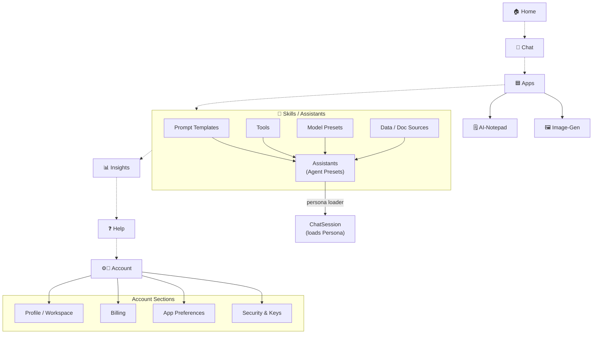

# Home/Sidebar

- Need better pins in home
- Examples and thoughts

```text
──────────────────── (Top static)
🏠 Home                -> Landing page, Recent activity, Dashboards
💬 Chat                -> Chat UI, Conversation lists

──────────────────── (Mid dynamic, Min 8px spacer above)

🟦 Apps                -> Grid & marketplace of installable apps
🗒️ AI-Notepad          -> Example pinned app
🖼️ Image-Gen           -> Example pinned app
// max 5 pinned-app icons, drag to rearrange list

──────────────────── (Mid dynamic, Min 8px spacer below)

──────────────────── (Bottom static)
// May be we can have "Assistants" in place of skills too and all the below are ways to create assistants
🧩 Skills             -> Build & edit: (Below tabs in a expanded drawer).
                        1. Prompts
                        2. Tools
                        3. Model presets
                        4. Data/Doc Sources
                        5. Assistants is a preset of things from above 4 things.

📊 Insights           -> Usage, cost, performance dashboards
❓ Help               -> Docs, tutorials, support
⚙️👤 Account           -> Manage: (Below tabs in a expanded drawer)
                        1. Profile/Workspace
                        2. Billing
                        // May combine 3 and 4 if required, depends on density of info in each
                        3. App preferences: Themes, shortcuts, etc.
                        4. Security & Keys.
```


